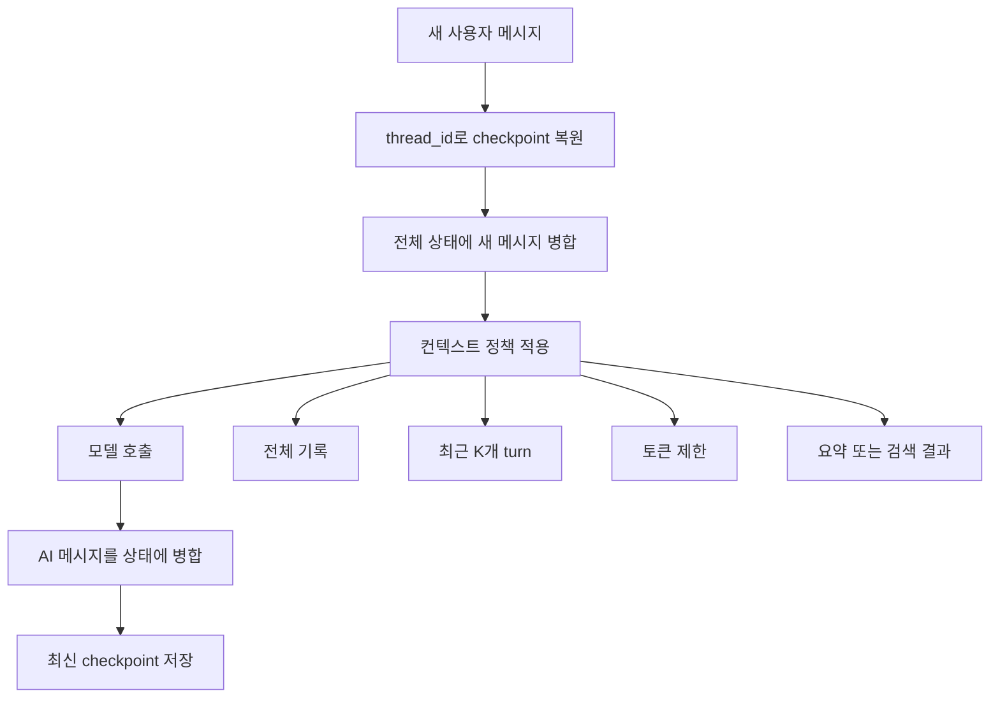
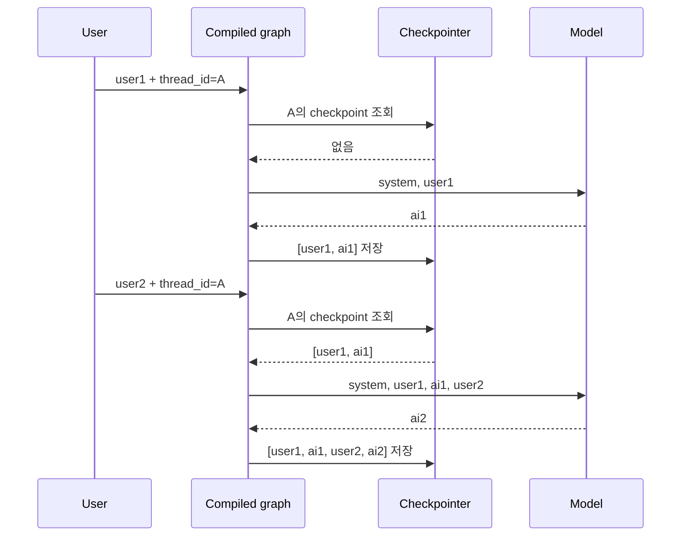
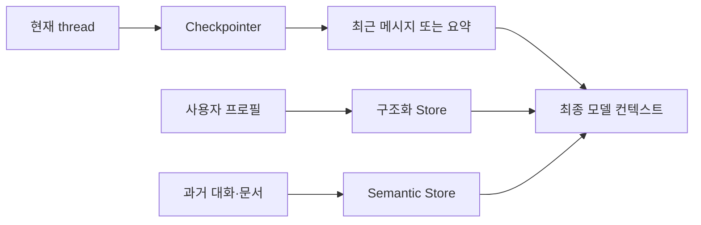
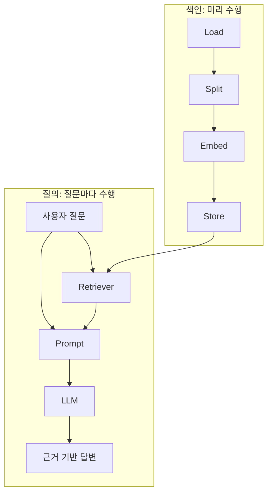
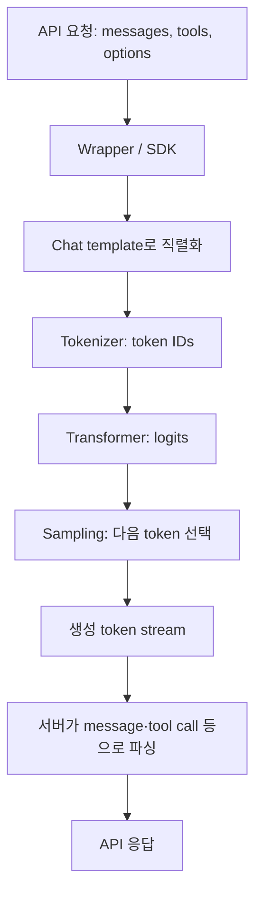

# LangChain · LangGraph 메모리와 RAG 수업 정리

> 정리 기준: 2026-09-18 수업 자료  sss

## 0. 먼저 보는 핵심 요약

이 자료의 가장 중요한 변화는 과거의 `Conversation*Memory` 객체 중심 설계에서 다음 구조로 이동했다는 점이다.

1. 대화 상태는 `MessagesState` 같은 **그래프 상태**로 표현한다.
2. 단기 대화 상태는 **checkpointer**가 `thread_id`별 checkpoint로 저장한다.
3. 전체 기록을 저장하는 일과 실제 모델에 넣을 컨텍스트를 고르는 일을 분리한다.
4. 여러 thread를 넘어 기억해야 할 사용자 정보·사실·문서는 **LangGraph Store** 같은 장기 메모리에 저장한다.
5. 긴 컨텍스트는 최근 K개 turn, 토큰 제한, 요약, 의미 검색을 목적에 맞게 조합해 관리한다.
6. RAG는 외부 문서를 `Load → Split → Embed → Store`한 뒤, 질문 시 `Retrieve → Prompt → LLM`으로 답을 만든다.

한 문장으로 줄이면 다음과 같다.

> **checkpointer는 한 대화의 실행 상태를 이어 주고, Store는 대화를 넘어 재사용할 지식을 보관한다.**

---

## 1. 전체 구조와 용어

### 1.1 단기 메모리와 장기 메모리

| 구분 | 단기 메모리 | 장기 메모리 |
|---|---|---|
| 주요 범위 | 하나의 대화 thread | 사용자·세션·프로젝트를 가로지르는 정보 |
| 저장 대상 | `messages`를 포함한 그래프 상태 | 프로필, 엔티티, 사실, 문서, 임베딩 |
| 핵심 도구 | checkpointer | Store 또는 외부 DB |
| 식별 기준 | `thread_id` | namespace + key |
| 대표 구현 | `InMemorySaver`, `SqliteSaver` | `InMemoryStore`, 영속 Store, 벡터 DB, 그래프 DB |
| 대표 질문 | “이 대화에서 방금 무슨 말을 했지?” | “이 사용자의 선호나 과거 사실은 무엇이지?” |

### 1.2 핵심 객체

- `MessagesState`: `messages` 필드를 가진 LangGraph 상태. 메시지를 추가하는 reducer가 설정되어 있어 노드는 보통 새 메시지만 반환한다.
- `StateGraph`: 상태를 읽고 갱신하는 노드와 간선을 정의한다.
- `checkpointer`: 각 실행 뒤 checkpoint를 저장하고 다음 호출 때 복원한다.
- `thread_id`: checkpoint를 찾는 기본 키. 같으면 대화가 이어지고 다르면 격리된다.
- `Store`: 장기 메모리를 `namespace`와 `key`로 저장·검색한다.
- `namespace`: 사용자·조직·메모리 유형을 계층적으로 분리하는 논리적 경로다.
- `context`: 모델이 답을 만들 때 실제로 참고하는 입력 전체다. 시스템 지시, 대화 일부, 검색 문서, 도구 결과 등이 포함될 수 있다.
- `template`: 반복되는 입력 구조에 실제 값들을 채워 넣기 위한 틀이다.
- `endpoint`: 클라이언트가 특정 API 기능을 호출하는 주소와 작업 단위다.

### 1.3 저장과 모델 입력은 같은 것이 아니다

전체 대화를 checkpoint에 보존하더라도 매번 전부 모델에 보낼 필요는 없다.



이 분리는 다음 이점을 준다.

- 감사·디버깅을 위한 원본 기록은 유지할 수 있다.
- 모델 입력 토큰과 비용을 줄일 수 있다.
- 사용 사례별로 컨텍스트 정책을 바꿀 수 있다.
- 장기 메모리 검색 결과를 필요한 순간에만 삽입할 수 있다.

---

## 2. 기본 LangGraph 대화 메모리

대부분의 노트북이 공유하는 최소 패턴은 아래와 같다.

```python
from langchain.messages import SystemMessage
from langgraph.checkpoint.memory import InMemorySaver
from langgraph.graph import END, START, MessagesState, StateGraph

SYSTEM_PROMPT = "당신은 정확하고 간결한 도우미입니다."


def call_model(state: MessagesState):
    response = model.invoke(
        [SystemMessage(content=SYSTEM_PROMPT), *state["messages"]]
    )
    return {"messages": [response]}


builder = StateGraph(MessagesState)
builder.add_node("model", call_model)
builder.add_edge(START, "model")
builder.add_edge("model", END)

chat = builder.compile(checkpointer=InMemorySaver())
```

호출할 때는 매번 새 사용자 메시지만 넘긴다.

```python
config = {"configurable": {"thread_id": "user-123:conversation-1"}}

result = chat.invoke(
    {"messages": [{"role": "user", "content": "제 이름은 테디입니다."}]},
    config=config,
)
```

같은 `thread_id`로 다시 호출하면 이전 checkpoint가 자동 복원된다.



상태는 레거시 `load_memory_variables()` 대신 `get_state()`로 확인한다.

```python
snapshot = chat.get_state(config)
messages = snapshot.values["messages"]
```

### `thread_id`에서 기억할 점

- 같은 compiled graph를 사용해도 `thread_id`가 다르면 상태는 분리된다.
- `thread_id`는 사용자 ID와 동일하지 않다. 한 사용자가 여러 대화를 가질 수 있으므로 보통 `user_id:conversation_id`처럼 설계한다.
- 클라이언트가 다른 사람의 `thread_id`를 임의로 사용할 수 없도록 서버에서 권한을 검증해야 한다.
- 호출 때 과거 전체 메시지를 다시 보내지 말고, 새 메시지만 추가하는 패턴을 지킨다.

---

## 3. 노트북별 핵심 내용

### 3.1 `01-ConversationBufferMemory`: 전체 대화 보존

과거 `ConversationBufferMemory`에 대응하는 가장 기본적인 형태다.

- `MessagesState`에 모든 human/AI 메시지를 누적한다.
- `InMemorySaver`가 `thread_id`별 상태를 저장한다.
- 같은 thread에서 두 번째 질문을 하면 첫 번째 질문과 답변까지 모델 입력에 포함된다.
- 다른 thread는 이전 대화를 보지 못한다.
- 최신 상태는 `chat.get_state(config)`로 조회한다.

적합한 경우:

- 대화가 짧고 모든 문맥이 중요한 프로토타입
- 에이전트 동작과 상태 복원을 처음 학습할 때

한계:

- 대화가 길어질수록 입력 토큰, 지연 시간, 비용이 계속 증가한다.
- 오래된 내용이 많으면 현재 질문과 무관한 정보가 모델을 방해할 수 있다.
- `InMemorySaver`는 프로세스가 종료되면 사라지므로 운영 영속 저장소가 아니다.

### 3.2 `02-ConversationBufferWindowMemory`: 최근 K개 turn

핵심은 **전체 상태는 보존하되 모델 호출 직전에 최근 기록만 선택**하는 것이다.

```python
K = 2


def context_for_model(messages):
    history, current_user_message = messages[:-1], messages[-1]
    recent_history = history[-2 * K:]
    return [
        SystemMessage(content=SYSTEM_PROMPT),
        *recent_history,
        current_user_message,
    ]
```

자료의 실행 결과에서는 checkpoint에 메시지 10개가 저장되어 있지만, 마지막 모델 호출에는 시스템 메시지를 포함해 6개만 전달된다.

주의점:

- `history[-2 * K:]`는 대화가 `human → ai` 쌍으로 정확히 반복된다는 가정에 의존한다.
- 도구 호출, 도구 결과, 중간 시스템 메시지가 섞인 agent에서는 단순히 `2 * K`개를 자르면 turn 경계가 깨질 수 있다.
- 이런 경우 메시지 역할과 tool-call 연관 관계를 보존하는 전용 선택 로직이 필요하다.
- 단순한 비용 절감이 목적이면 상태에서 오래된 메시지를 삭제하는 것보다 입력 선택만 제한하는 편이 유연하다.

### 3.3 `03-ConversationTokenBufferMemory`: 토큰 예산으로 자르기

메시지 개수 대신 토큰 예산을 사용한다. 길이가 크게 다른 메시지가 섞일 때 K-window보다 예측 가능하다.

```python
from langchain.messages import SystemMessage, trim_messages


def trim_for_model(messages):
    return trim_messages(
        [SystemMessage(content=SYSTEM_PROMPT), *messages],
        max_tokens=80,
        token_counter="approximate",
        strategy="last",
        start_on="human",
        include_system=True,
        allow_partial=False,
    )
```

옵션의 의미:

| 옵션 | 의미 |
|---|---|
| `strategy="last"` | 최신 메시지부터 남긴다. |
| `start_on="human"` | 잘린 결과가 가능한 한 사용자 메시지에서 시작하도록 한다. |
| `include_system=True` | 시스템 메시지를 유지한다. |
| `allow_partial=False` | 메시지 문자열 중간을 잘라 불완전하게 넣지 않는다. |
| `token_counter="approximate"` | 빠르고 공급자 독립적인 근사 토큰 수를 사용한다. |

자료의 예제는 약 118토큰의 입력을 약 65토큰으로 줄였다. 실제 청구량·정확한 한도 관리가 중요하면 사용 모델에 맞는 정확한 tokenizer 또는 model counter를 사용해야 한다.

### 3.4 `04-ConversationEntityMemory`: 구조화된 엔티티 장기 메모리

자유 형식 대화를 그대로 저장하는 대신 Pydantic 스키마로 사람 정보를 추출한다.

```python
class Person(BaseModel):
    name: str
    occupation: str | None = None
    relationship: str | None = None
    plans: list[str] = Field(default_factory=list)


class People(BaseModel):
    people: list[Person]


entity_extractor = model.with_structured_output(People)
```

저장 구조:

```python
namespace = ("users", user_id, "entities")
entity_store.put(namespace, person.name, person.model_dump(exclude_none=True))
```

장점:

- 스키마가 메모리의 계약이 된다.
- 검증, 병합, 필드별 검색, UI 표시가 자유 형식 요약보다 쉽다.
- 사용자별 namespace로 데이터를 격리할 수 있다.

운영 전에 정해야 할 정책:

- 새 사실과 기존 사실이 충돌하면 덮어쓸지, 버전을 남길지
- 빈 값이나 빈 목록이 기존의 유효한 값을 지우지 않게 할지
- 이름 표기 차이와 동명이인을 어떻게 식별할지
- 민감 정보를 저장할 수 있는지, 언제 삭제할지
- 즉시 저장(hot path)할지 백그라운드에서 정리할지

예제의 얕은 딕셔너리 병합은 이해하기 쉽지만, `plans` 같은 목록 필드를 합치거나 사실의 출처·시점을 관리하지는 않는다.

### 3.5 `05-ConversationKnowledgeGraph`: 관계 triple

대화에서 명시된 사실을 `(subject, predicate, object)` 구조로 추출한다.

```python
class Triple(BaseModel):
    subject: str
    predicate: str
    object: str
```

예:

```text
(김셜리씨, 거주한다, 판교)
(김셜리씨, 직업, 신입 디자이너)
(테디, 동료이다, 김셜리씨)
```

자료는 `subject|predicate|object`를 해시해 key로 사용한다. 같은 triple을 다시 넣어도 같은 key가 되어 단순 중복을 줄일 수 있다.

중요한 원칙:

- 텍스트에 **명시된 사실만** 추출하고 추론을 사실처럼 저장하지 않는다.
- 답변할 때도 검색된 edge만 근거로 사용하고, 근거가 없으면 모른다고 한다.
- 엔티티 정규화, 동의어, 출처, 유효 기간, 삭제·수정 이력을 별도로 설계해야 한다.
- 예제의 전체 스캔 + 부분 문자열 조회는 소규모 학습용이다. 다중 hop, 역방향 index, 대규모 관계 질의에는 Neo4j 같은 그래프 DB가 더 적합하다.

### 3.6 `06-ConversationSummary`: 긴 대화 요약

`SummarizationMiddleware`는 임계치를 넘은 오래된 대화를 요약으로 대체하고 최근 메시지를 그대로 유지한다.

```python
summary_agent = create_agent(
    model=model,
    tools=[],
    system_prompt="가격과 취소 조건을 정확히 기억하세요.",
    middleware=[
        SummarizationMiddleware(
            model=model,
            trigger=("messages", 8),
            keep=("messages", 4),
        )
    ],
    checkpointer=InMemorySaver(),
)
```

운영에서는 메시지 개수보다 `trigger=("tokens", 4000)`처럼 실제 컨텍스트 예산에 맞춘 기준이 보통 더 유용하다.

요약의 장단점:

- 장점: 오래된 정보의 핵심을 어느 정도 유지하면서 입력 길이를 줄인다.
- 비용: 요약을 만들기 위한 추가 모델 호출이 발생한다.
- 위험: 잘못 요약하거나 중요한 세부 정보를 잃을 수 있다.

따라서 주문 번호, 금액, 예약 조건, 사용자 설정처럼 정확히 보존해야 하는 값은 요약에만 맡기지 말고 구조화 상태나 Store에 별도로 저장해야 한다.

### 3.7 `07-VectorStoreRetrieverMemory`: 의미 기반 장기 메모리

대화를 시간순으로 모두 넣는 대신, 현재 질문과 의미적으로 가까운 기억만 검색한다.

```python
memory_store = InMemoryStore(
    index=IndexConfig(
        embed=embeddings,
        dims=1536,
        fields=["text"],
    )
)

namespace = ("users", "candidate-001", "interview-memories")
memory_store.put(namespace, "turn-1", {"text": "...", "turn": 1})

results = memory_store.search(
    namespace,
    query="지원자가 프로젝트에서 맡은 업무는?",
    limit=2,
)
```

검색 결과는 자동으로 모델에 들어가지 않는다. 애플리케이션이 다음을 직접 정한다.

- 어떤 namespace를 검색할지
- `top-k`를 얼마로 할지
- 관련성 임계값을 둘지
- 검색 결과를 어떤 순서와 형식으로 프롬프트에 넣을지
- 근거가 없을 때 답변을 거절할지

벡터 검색은 표현이 달라도 의미가 비슷한 기억을 찾는 데 강하지만, 정확한 키워드·번호·코드 검색에는 약할 수 있다. 실무에서는 키워드 검색과 결합한 하이브리드 검색을 고려한다.

### 3.8 `08-LCEL-add-memory`: LCEL 체인을 그래프 노드로 사용

LCEL의 `prompt | model` 조합은 유지하면서 메모리는 LangGraph checkpointer로 통일한다.

```python
prompt = ChatPromptTemplate.from_messages(
    [
        ("system", "당신은 친절하고 간결한 챗봇입니다."),
        MessagesPlaceholder(variable_name="messages"),
    ]
)
lcel_chain = prompt | model


def call_lcel(state: MessagesState):
    response = lcel_chain.invoke({"messages": state["messages"]})
    return {"messages": [response]}
```

핵심은 LCEL runnable을 graph node 안에서 호출한다는 점이다. 대화 상태, 스레드 격리, 상태 조회, 중단·재개, 영속 저장을 LangGraph의 공통 메커니즘으로 관리할 수 있다.

### 3.9 `09-Memory-using-SQLite`: 프로세스 재시작 뒤에도 복원

`InMemorySaver` 대신 `SqliteSaver`를 사용하면 같은 DB 파일과 `thread_id`로 상태를 복원할 수 있다.

```python
import sqlite3
from langgraph.checkpoint.sqlite import SqliteSaver

connection = sqlite3.connect(
    "conversation_checkpoints.sqlite",
    check_same_thread=False,
)
checkpointer = SqliteSaver(connection)
checkpointer.setup()
```

자료는 연결을 닫고 같은 SQLite 파일로 새 agent를 만든 뒤 이름을 다시 기억하는 과정을 보여 준다.

운영 관점:

- SQLite는 로컬 실습과 단일 프로세스·소규모 서비스에 적합하다.
- 여러 서버 인스턴스, 높은 동시성, 백업·복구가 중요하면 Postgres 같은 서버형 checkpointer가 일반적으로 더 적합하다.
- `check_same_thread=False`는 SQLite의 동시성 문제를 자동 해결하는 옵션이 아니다. 연결 공유, 잠금, 트랜잭션 정책을 따로 관리해야 한다.
- 애플리케이션 종료 시 연결을 닫고, DB 파일 초기화는 명시적으로 수행한다.

### 3.10 `10-Conversation-With-History`: `create_agent`의 고수준 패턴

`create_agent`에 checkpointer를 넘기면 LangGraph 기반 multi-turn agent를 간단히 구성할 수 있다.

```python
agent = create_agent(
    model=MODEL_ID,
    tools=[],
    system_prompt="현재 thread의 기록을 활용해 답하세요.",
    checkpointer=InMemorySaver(),
)


def ask(question: str, thread_id: str) -> str:
    result = agent.invoke(
        {"messages": [{"role": "user", "content": question}]},
        config={"configurable": {"thread_id": thread_id}},
    )
    return result["messages"][-1].content
```

동일 thread에서는 이름을 기억하고, 다른 thread에서는 알지 못한다. 이 기억은 thread 내부 단기 메모리이므로 여러 대화를 넘어 사용자 프로필을 기억하려면 Store를 함께 사용해야 한다.

---

## 4. 메모리 전략 선택 가이드

| 요구사항 | 추천 전략 | 핵심 이유 |
|---|---|---|
| 짧은 대화 전체를 그대로 기억 | 전체 buffer + checkpointer | 가장 단순하고 정보 손실이 없음 |
| 최근 대화만 중요 | 최근 K개 turn | 구현이 단순하고 입력 크기가 안정적 |
| 메시지 길이 편차가 큼 | 토큰 기반 trimming | 컨텍스트 한도와 비용을 직접 관리 |
| 오래된 대화의 요지를 유지 | 요약 + 최근 메시지 | 장기 대화의 핵심을 압축 |
| 이름·선호·설정처럼 필드가 정해짐 | 구조화 엔티티 Store | 검증·병합·갱신이 쉬움 |
| 사람·회사·장소 간 관계 질의 | triple/그래프 메모리 | 관계 탐색이 명시적 |
| 과거 기록 중 현재 질문과 관련된 것만 필요 | 의미 검색 Store | 질문별 관련 기억만 주입 |
| 재시작 뒤에도 같은 대화 복원 | SQLite/Postgres checkpointer | checkpoint 영속화 |

실무에서는 하나만 고르기보다 조합한다.



권장 조합 예:

- 최근 대화: 토큰 trimming
- 오래된 대화: 요약
- 반드시 정확해야 하는 사실: 구조화 Store
- 관련 문서와 과거 사례: 의미 검색
- 실행 복구: 영속 checkpointer

---

## 5. RAG 핵심

### 5.1 RAG란

RAG(Retrieval-Augmented Generation)는 LLM이 학습 과정에서 알지 못한 사내 문서·최신 자료 등을 먼저 검색하고, 검색한 내용을 근거로 답하게 하는 구조다.

목적:

- 모델 학습 시점 이후의 정보 활용
- 사내·개인 문서 활용
- 답변 근거 제시
- 근거 없는 생성, 즉 환각 감소

단, RAG가 환각을 자동으로 없애 주는 것은 아니다. 검색 실패, 잘못된 문서, 부정확한 chunk, 프롬프트 누락이 있으면 답도 잘못될 수 있다.

### 5.2 기본 RAG 파이프라인



#### 1) Load

PDF, Word, 웹 페이지, CSV, Notion 등 원본을 불러와 `Document`로 변환한다.

- `page_content`: 본문
- `metadata`: 출처, 페이지, 제목, 작성일, 권한 등

metadata는 출처 표시, 필터링, 접근 제어에 중요하다.

#### 2) Split

긴 문서를 검색 가능한 chunk로 나눈다.

- `chunk_size`: 한 조각의 크기
- `chunk_overlap`: 조각 사이에 겹쳐 둘 내용

너무 작으면 문맥이 끊기고, 너무 크면 검색 결과에 불필요한 내용이 섞인다. 문서 구조와 질문 유형에 맞춰 조정해야 한다.

#### 3) Embed

각 chunk를 의미를 나타내는 숫자 벡터로 바꾼다. 의미가 비슷한 문장은 벡터 공간에서 가까워지도록 학습된 임베딩 모델을 사용한다.

#### 4) Store

벡터, 원문, metadata를 벡터 저장소에 보관한다. 예시로 FAISS, Chroma, Pinecone 등이 있다.

#### 5) Retriever

질문을 임베딩하고 유사한 chunk를 `top-k`개 가져온다. MMR은 관련성뿐 아니라 결과 간 다양성도 고려해 중복된 chunk가 몰리는 현상을 줄인다.

#### 6) Prompt

검색 결과와 질문을 하나의 지시문으로 조합한다.

```text
다음 문맥만 근거로 질문에 답하세요.
근거가 없으면 모른다고 답하세요.

[문맥]
{context}

[질문]
{question}
```

#### 7) LLM

조합된 컨텍스트를 바탕으로 답변을 생성한다. 답변에는 가능하면 근거 문서의 출처·페이지를 함께 표시한다.

#### 8) Chain

검색, 프롬프트 구성, 모델 호출, 출력 파싱을 하나의 실행 흐름으로 연결한다.

### 5.3 LCEL

LCEL(LangChain Expression Language)은 `Runnable`들을 `|`로 연결한다.

```python
chain = (
    {"context": retriever, "question": RunnablePassthrough()}
    | prompt
    | llm
    | StrOutputParser()
)
```

공통 인터페이스로 `invoke`, `stream`, `batch`, 비동기 실행을 사용할 수 있고, 병렬 실행과 분기도 구성할 수 있다.

### 5.4 Advanced RAG

| 기법 | 역할 |
|---|---|
| Reranker | 1차 검색 결과를 더 정교한 모델로 재채점해 순서를 개선 |
| Hybrid Search | BM25 키워드 검색과 벡터 의미 검색을 결합 |
| Query Rewriting | 모호한 질문을 검색하기 좋은 형태로 다시 작성 |
| Multi-Query | 질문을 여러 표현으로 확장해 재현율을 높임 |
| Parent Document Retriever | 작은 chunk로 찾고 더 큰 부모 문서를 반환 |
| Contextual Compression | 검색 결과에서 질문에 필요한 부분만 압축 |

### 5.5 Agent, 평가, 배포

Agent는 고정된 chain과 달리 질문에 따라 문서 검색, 웹 검색, 계산기, DB 조회 같은 도구를 선택하고 결과를 보고 다음 행동을 결정한다.

RAG 평가는 최소한 검색과 생성을 나눠서 본다.

| 지표 | 확인하는 것 |
|---|---|
| Faithfulness | 답변이 검색 문서에 근거하는가 |
| Answer Relevancy | 답변이 질문에 직접 대응하는가 |
| Context Precision | 검색 결과 중 실제로 유용한 비율이 높은가 |
| Context Recall | 답에 필요한 근거를 충분히 검색했는가 |

평가용 질문·정답·근거 데이터셋을 만들고, 변경 전후 결과를 같은 데이터로 비교해야 한다. LLM-as-a-Judge를 쓸 수 있지만 사람 검수와 정답 기반 평가를 함께 두는 편이 안전하다.

배포 시에는 FastAPI 같은 API 계층이나 Streamlit 같은 UI를 붙일 수 있다. 모델 품질뿐 아니라 인증, 문서 접근 권한, 로그의 개인정보, timeout, 재시도, 비용 제한, 관측 가능성을 함께 설계해야 한다.

---

## 6. LLM 입출력 계층



핵심:

- API의 `system`, `user`, `assistant`, `tools` 같은 구조는 모델에 들어가기 전에 모델별 chat template로 직렬화된다.
- tokenizer는 문자열을 `input_ids`라는 정수 배열로 바꾼다.
- 모델은 각 위치에서 어휘 전체에 대한 점수인 `logits`를 출력한다.
- temperature, top-p 같은 샘플링 설정을 적용해 다음 토큰을 고르고, 이를 반복해 문장을 만든다.
- 서버는 생성된 토큰 스트림을 다시 텍스트, 도구 호출, 종료 사유 같은 API 필드로 파싱한다.
- `logprobs`는 선택한 토큰 또는 후보 토큰의 로그 확률이다. 모델·API·endpoint에 따라 제공 여부와 응답 형식이 다르다.
- 오픈 웨이트 모델은 가중치를 공개한 모델을 뜻한다. 학습 코드·데이터·라이선스까지 모두 개방됐다는 의미와는 다르다.

특정 모델의 “날것” 형식을 확인하려면 해당 모델 tokenizer의 `chat_template`과 공식 문서를 확인해야 한다. 폐쇄형 모델의 내부 템플릿을 공개된 다른 모델로 단정해서는 안 된다.

---

## 7. 메모리와 RAG의 관계

대화 메모리와 RAG는 둘 다 모델에 컨텍스트를 공급하지만 저장 단위와 검색 목적이 다르다.

| 관점 | 대화 메모리 | RAG |
|---|---|---|
| 주 데이터 | 대화 상태, 사용자 사실, 과거 interaction | 문서와 지식 자료 |
| 대표 검색 기준 | thread, 사용자, 최근성, 의미 유사도 | 질문과 문서 chunk의 관련성 |
| 주요 저장소 | checkpointer, Store | 벡터 DB, 검색 엔진 |
| 업데이트 | 대화 중 자주 발생 | 문서 색인 시점 또는 변경 시 |
| 핵심 위험 | 다른 사용자 상태 혼합, 오래된 기억, 민감 정보 | 잘못된 문서 검색, 권한 누출, 근거 없는 답변 |

둘을 결합한 agent의 컨텍스트는 보통 다음처럼 구성할 수 있다.

```text
시스템 정책
+ 현재 thread의 최근 메시지
+ 장기 메모리에서 찾은 사용자 사실
+ RAG로 찾은 업무 문서
+ 현재 질문
```

컨텍스트가 많을수록 무조건 좋은 것은 아니다. 각 정보의 출처, 신뢰도, 최신성, 접근 권한을 확인하고 현재 질문에 필요한 것만 넣어야 한다.

---

## 8. 실무 설계 체크리스트

### 상태와 식별자

- [ ] `thread_id`, `user_id`, `conversation_id`의 의미를 구분했는가?
- [ ] 서버가 thread 접근 권한을 검증하는가?
- [ ] 새 호출에는 새 메시지만 추가하는가?
- [ ] checkpoint 보존 기간과 삭제 정책이 있는가?

### 컨텍스트 정책

- [ ] 전체 기록, K-window, 토큰 trimming, 요약 중 무엇을 쓸지 정했는가?
- [ ] tool call과 tool result가 잘릴 때 연결 관계가 유지되는가?
- [ ] 시스템 메시지가 trimming 뒤에도 보존되는가?
- [ ] 모델 컨텍스트 한도보다 안전 여유를 두었는가?

### 장기 메모리

- [ ] namespace에 사용자·조직·메모리 종류가 명확히 포함되는가?
- [ ] 구조화 스키마와 필드별 병합 정책이 있는가?
- [ ] 사실의 출처, 생성 시각, 갱신 시각, 유효 기간을 저장하는가?
- [ ] 사용자가 자신의 메모리를 조회·수정·삭제할 수 있는가?
- [ ] 민감 정보와 불필요한 원문 저장을 최소화했는가?

### RAG

- [ ] chunk 크기와 overlap을 실제 질문으로 평가했는가?
- [ ] metadata에 출처와 접근 권한이 있는가?
- [ ] 검색 결과가 없거나 약할 때 모른다고 답하는가?
- [ ] top-k, threshold, reranking 정책을 평가 데이터로 조정했는가?
- [ ] 답변에 근거 문서와 페이지를 연결할 수 있는가?

### 운영

- [ ] 로컬용 `InMemorySaver`/SQLite와 운영용 저장소를 구분했는가?
- [ ] 동시성, 재시도, timeout, 트랜잭션을 설계했는가?
- [ ] 토큰 사용량과 모델 호출 비용을 관측하는가?
- [ ] 프롬프트·검색·모델 버전 변경 전후를 같은 평가셋으로 비교하는가?
- [ ] 로그에 개인정보와 비밀키가 남지 않는가?

---

## 9. 파일별 빠른 색인

| 파일 | 핵심 주제 |
|---|---|
| `01-ConversationBufferMemory(3).ipynb` | 전체 메시지 + checkpointer |
| `02-ConversationBufferWindowMemory(3).ipynb` | 최근 K개 turn만 모델에 전달 |
| `03-ConversationTokenBufferMemory(3).ipynb` | `trim_messages()`로 토큰 예산 관리 |
| `04-ConversationEntityMemory(3).ipynb` | 구조화 엔티티 추출과 Store upsert |
| `05-ConversationKnowledgeGraph(3).ipynb` | triple 추출·저장·근거 기반 답변 |
| `06-ConversationSummary(3).ipynb` | `SummarizationMiddleware` |
| `07-VectorStoreRetrieverMemory(3).ipynb` | embedding 기반 의미 검색 |
| `08-LCEL-add-memory(3).ipynb` | LCEL runnable + LangGraph checkpointer |
| `09-Memory-using-SQLite(3).ipynb` | SQLite checkpoint 영속화 |
| `10-Conversation-With-History(3).ipynb` | `create_agent` multi-turn 메모리 |

---

## 10. 최종 정리

이번 자료의 핵심은 “대화를 무조건 길게 붙이는 것”이 메모리가 아니라는 점이다. 좋은 메모리 설계는 다음 질문에 답해야 한다.

1. 무엇을 저장할 것인가?
2. 어떤 키로 격리할 것인가?
3. 언제 다시 꺼낼 것인가?
4. 모델에는 어느 정도만 넣을 것인가?
5. 오래되거나 충돌하는 정보는 어떻게 갱신·삭제할 것인가?
6. 사용자의 민감 정보와 접근 권한을 어떻게 보호할 것인가?

LangGraph의 checkpointer는 thread 상태를 이어 주고, Store는 장기 지식을 관리하며, trimming·요약·검색은 실제 모델 컨텍스트를 구성한다. 여기에 RAG를 결합하면 대화 기록뿐 아니라 외부 문서까지 근거로 사용하는 agent를 만들 수 있다.